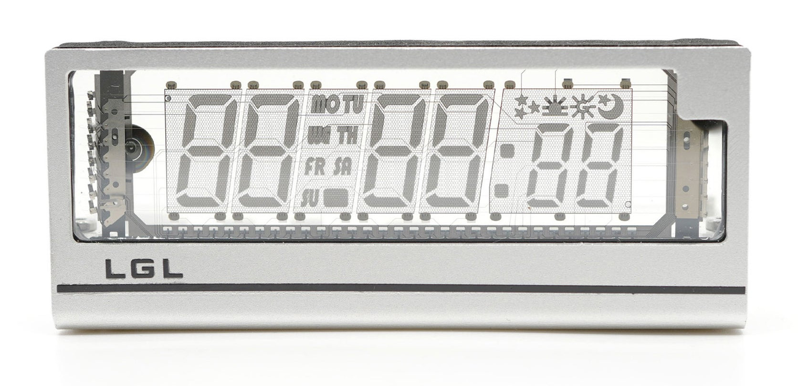

# LGL VCK CCCP 2024

## Pinout
* ADC - Light-dependent resistor
* GPIO0 - Left button (requires pull-up)
* GPIO1 (TX) - Pad 2
* GPIO2 - LED
* GPIO3 (RX) - Pad 1
* GPIO4 - RX-8025 SDA
* GPIO5 - RX-8025 SCL
* GPIO12 - Right button (requires pull-up)
* GPIO13 - PT6315 DIN
* GPIO14 - PT6315 CLK
* GPIO15 - PT6315 STB
* GPIO16 - Buzzer
* 5V - Pad 3
* GND - Pad 4

**Note**: pads are numbered 1 to 4 from left to right, with the clock face facing away from you.
